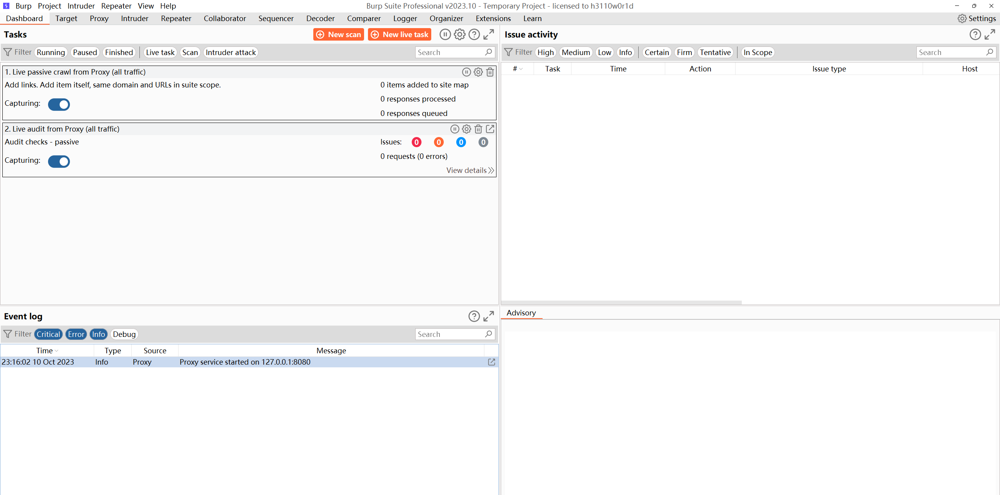
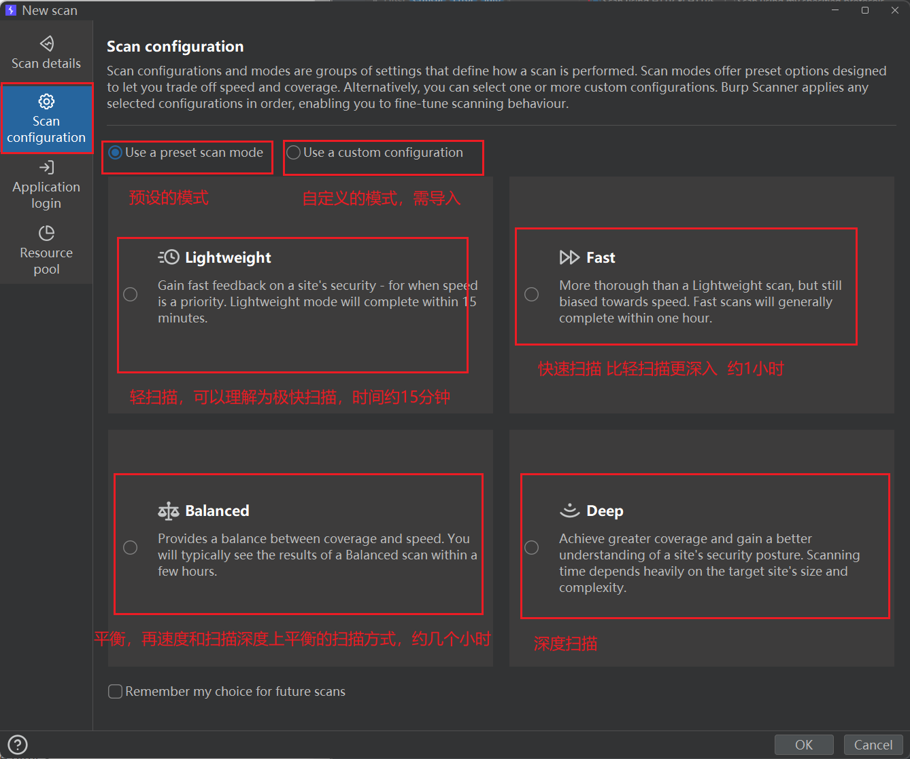
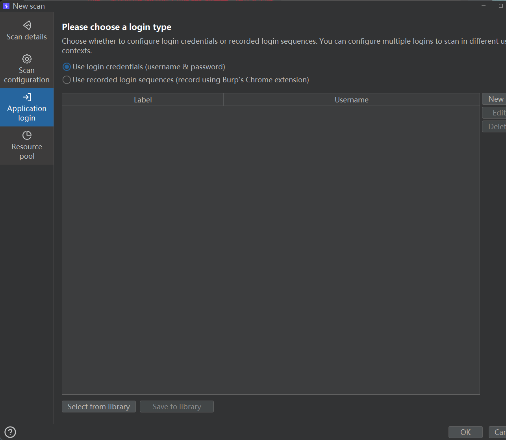
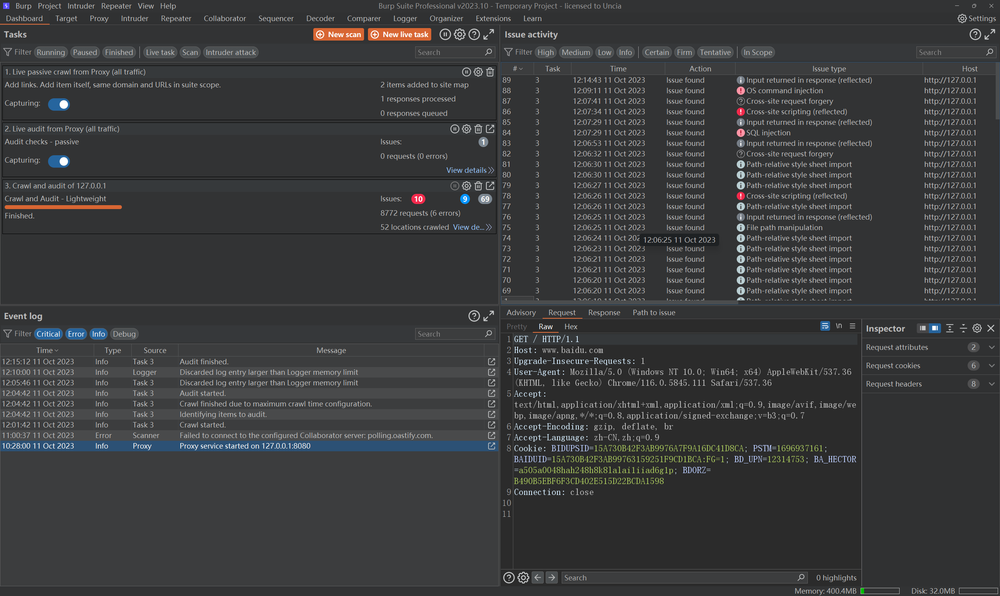

#Burp suite 使用教程

##使用：

> 1.pikachu（登录127.0.0.1 **记得打开小皮面板**）  
>
> 2.burpsuite  
>
> 3.火狐/谷歌（**插件foxproxy**）

##认识界面

​	###主窗口

​	###设置  

​			古人云，工欲善其事，必先利其器，那么当我们拿到这个软件的首要任务就是要先配置好它，以减少后续过程中在关键时刻突然产生的麻烦。

​			由于软件是用第三方工具去激活的，在很多情况下会出现需要重新激活的情况，这往往导致我们的设置丢失，需要重新配置，所以了解基本设置是必不可少的。

​		####字体与大小

> 窗口字体设置：
>
> 设置--User interface -- Display -- Appearance （font size字体大小，Theme  颜色主题）
>
> 
>
> 
>
> HTTP信息习惯设置（编辑器字体）：
>
> 设置--User interface -- Inspector and message editor --HTTP message display
>
> 
>
> 编码格式设置（不设置会出现乱码和无法显示）：
>
> 1.先修改字体，设置成中文字体
>
> 
>
> 2.再修改编码，选择UTF-8
>
> 
>
> 基本的设置完成后，我们就可以开始使用了

​	###Dashboard和Target模块

​		当我们打开软件时，首先映入眼帘的就是Dashboard模块，Dashboard直译为仪表盘

​	

​	####第一功能：扫描及审计

​	使用New scan新建扫描

​	如图所示，最下面没有写的是高级扫描参数可以实现高级参数扫描

​	接下来是选择扫描的方式

​	第三是登录用户设置，将应用程序登录添加到扫描中可以使urp Scannert发现只有经过身份验证的用户才能访问的内容。Burp扫描程序在爬网应用程序时使用应用程序登录名。您不能为Audit所选项目扫描指定应用程序登录，因为这些扫描不会爬网目标。

​	扫描结果：

​	具体怎么看会再Target里详细讲

​	###Proxy模块和Target模块

​	###Target模块作用的再讨论

​	###Repeater模块

​	###数据的加解密码

​	###intruder模块使用介绍

​	###Decoder加解密模块

​	###Logger模块

​	###Comparer数据比较模块

​	###Extender 插件环境模块