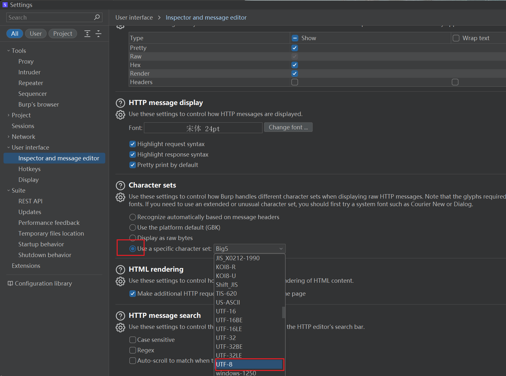
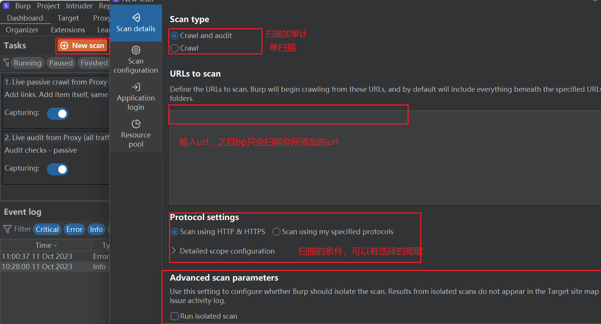

# Burp suite 使用教程

## 使用：

> 1.pikachu（登录127.0.0.1 **记得打开小皮面板**）  
>
> 2.burpsuite  
>
> 3.火狐/谷歌（**插件foxproxy**）

## 认识界面

<<<<<<< HEAD
### 主窗口

### 设置  
=======
​	### 主窗口

​	### 设置  
>>>>>>> 6867dcc438d7f25c7584e19953413f8c50d90954

古人云，工欲善其事，必先利其器，那么当我们拿到这个软件的首要任务就是要先配置好它，以减少后续过程中在关键时刻突然产生的麻烦。

由于软件是用第三方工具去激活的，在很多情况下会出现需要重新激活的情况，这往往导致我们的设置丢失，需要重新配置，所以了解基本设置是必不可少的。

#### 字体与大小

> 窗口字体设置：
>
> 设置--User interface -- Display -- Appearance （font size字体大小，Theme  颜色主题）
>
> 
>
> 
>
> HTTP信息习惯设置（编辑器字体）：
>
> 设置--User interface -- Inspector and message editor --HTTP message display
>
> 
>
> 编码格式设置（不设置会出现乱码和无法显示）：
>
> 1.先修改字体，设置成中文字体
>
> 
>
> #### 修改编码，选择UTF-8
>
> 
>
> 基本的设置完成后，我们就可以开始使用了

<<<<<<< HEAD
### Dashboard和Target模块
=======
​	### Dashboard和Target模块
>>>>>>> 6867dcc438d7f25c7584e19953413f8c50d90954

​		当我们打开软件时，首先映入眼帘的就是Dashboard模块，Dashboard直译为仪表盘

​	

<<<<<<< HEAD
​	

#### 第一功能：扫描及审计
=======
​	#### 第一功能：扫描及审计
>>>>>>> 6867dcc438d7f25c7584e19953413f8c50d90954

​	使用New scan新建扫描

​	如图所示，最下面没有写的是高级扫描参数可以实现高级参数扫描

​	接下来是选择扫描的方式

第三是登录用户设置，将应用程序登录添加到扫描中可以使urp Scannert发现只有经过身份验证的用户才能访问的内容。Burp扫描程序在爬网应用程序时使用应用程序登录名。您不能为Audit所选项目扫描指定应用程序登录，因为这些扫描不会爬网目标。

​	扫描结果：

​	具体怎么看会再Target里详细讲

<<<<<<< HEAD
### Proxy模块和Target模块

​	Proxy，中文名代理，是我们经常抓包并进行暴力破解的方式，这里将使用小皮桌面来进行学习

##### 基于表单的攻击方式

###### 拦截并抓取

​	抓包前，我们先清理历史记录，减少我们后续找文件的难度

下一步打开拦截

下一步抓到我们像要的包后，右键选择上传到inturder（爆破）模块

这里将详细将一下Intruder这里面的区别

当我们只要跑密码时，我们将用sniper，而如果我们不知道账号和密码，我们应使用cluster bomb，这里将演示不知道账号密码的情况。

标上我们要替换的两个字段

设置好字典

如此我们就找到账号密码

###### 验证码绕过后端

首先说明***验证码绕过后端的方法只适应于验证码生成后不销毁的条件***

因为验证码不销毁，说明后续验证码相同，所以我们可以一直使用这个验证码

操作和直接攻击相同

###### 验证码绕过前端

验证码在前端，但我们发送包是可以绕过前端的，所以直接发送即可

操作与直接攻击相同

###### Target模块作用的再讨论

##### Repeater模块

### 数据的加解密码

### intruder模块使用介绍

### Decoder加解密模块

### Logger模块

### Comparer数据比较模块

### Extender 插件环境模块
=======
​	### Proxy模块和Target模块

​	### Target模块作用的再讨论

​	### Repeater模块

​	### 数据的加解密码

​	### intruder模块使用介绍

​	### Decoder加解密模块

​	### Logger模块

​	### Comparer数据比较模块

​	### Extender 插件环境模块
>>>>>>> 6867dcc438d7f25c7584e19953413f8c50d90954
